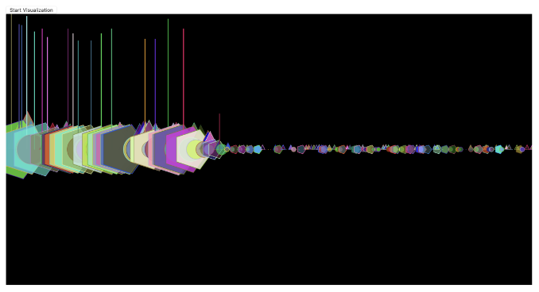
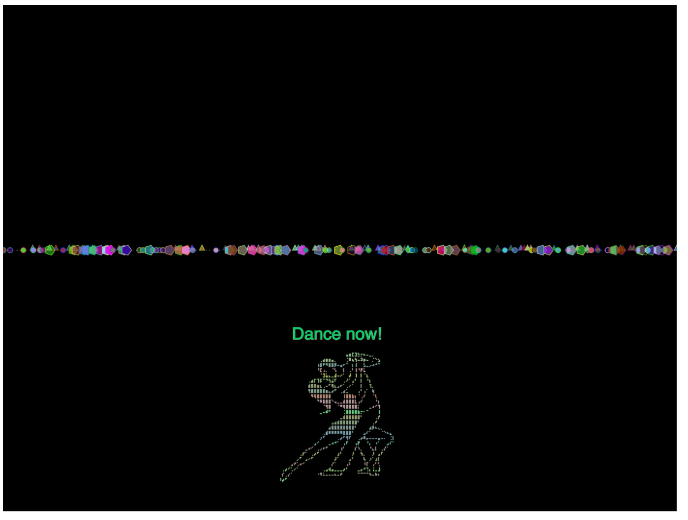

# 🎧 EDM Audio Visualizer with Speech Commands

This is an interactive audio visualization project built using [p5.js](https://p5js.org/), [Meyda](https://meyda.js.org/), and [Annyang](https://www.talater.com/annyang/) speech recognition. It combines dynamic spectrum animations, speech-controlled interactions, and EDM-inspired ASCII art to create a club-like vibe right in your browser.

## 🚀 Features

- 🎵 **Audio Analysis via FFT & Meyda**  
  Real-time extraction and visualization of:
  - Spectral Flux
  - Chroma
  - Spectral Centroid
  - Zero Crossing Rate (ZCR)
  - RMS (loudness)

- 🗣️ **Voice Command Integration**  
  Control the experience using these commands:
  - `play` – plays the song
  - `pause` – pauses playback
  - `dance` – triggers a dance animation + ASCII rave art

- 🎨 **Visuals & Mapping**  
  - Spectrum bars with random shape & color bursts
  - Circular chroma visualizer
  - Animated energy circles representing RMS, ZCR, and Flux
  - Glitchy, vibrant rave ASCII animations on keyword `dance`

- ⚡ **Electric "Dance now!" Title**  
  Appears in rave mode in flashing rainbow colors

## 📸 Screenshots

  

## 🛠️ Technologies Used

- [p5.js](https://p5js.org/)
- [p5.sound](https://p5js.org/reference/#/libraries/p5.sound)
- [Meyda](https://meyda.js.org/)
- [Annyang](https://www.talater.com/annyang/) – browser-based speech recognition
- HTML5 + JavaScript

## 🧠 Audio Feature Mapping Justification

This project explores the visual translation of audio features into artistic visuals. Each chosen feature was mapped with specific visual intentions:

- **Spectral Flux** → Pulsing size & motion (represents change in energy)
- **Chroma** → Rotating color palette (harmonic fingerprint)
- **RMS** → Bubble size / glow (overall loudness)
- **ZCR** → Shape variations (percussive vs tonal quality)
- **Spectral Centroid** → Brightness cues (low vs high energy content)

These mappings enhance musical perception through motion and color, amplifying the emotional and rhythmic qualities of EDM music.

🎧 Audio Credits
Track: Kalte Ohren (Remix)

#### 🔥 Inspired by rave culture & visual performance art.
